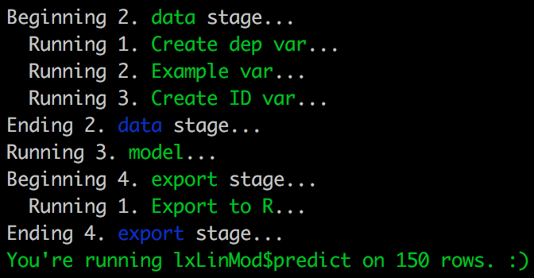

# Using Microsoft / RevoscaleR for modeling

A [Syberia](https://github.com/syberia/syberia) engine written at an
[R in Finance 2017](https://github.com/robertzk/rfinance17) conference 30-min break
to operationalize Microsoft R tooling.

See the [model file example](https://github.com/robertzk/MicrosoftR/blob/master/models/dev/lendingclub.R)
that will illustrate RevoscaleR models.

```r
# Open R from the root of this project and execute:
run('lending')
model$predict(iris, verbose = TRUE)
```

You should see a stubbed message.



## Goal

The full [goal specification](https://github.com/robertzk/rfinance17-notes/blob/master/random-ideas.md#revolution-analytics--microsoft-engine) 
outlines what we wish to accomplish: to turn all Microsoft R tools
into a unified modeling framework.

For more info see how to [operationalize R models using Azure](https://github.com/Azure/Machine-Learning-Operationalization). Other items to integrate are: [R batching](https://github.com/Azure/rAzureBatch)

## Other code

In the near future we will integrate the capabilities illustrated in the
below script into the MicrosoftR engine.

```r
library(RevoScaleR)
conStr <- "Driver string"
ds <- RxSqlServerData(sqlQuery = "SELECT revol, ....")
df <- rxImport(ds)
rxSetComputeContext("local")
dxForestModel <- rxDForest(is_bad ~ revol_util + ..., df)

# Or train model remotely:
sqlCC <- RxInSqlServer(connectingString = conStr)
rxSetComputeContext(sqlCC)
dForestModel <- rxDForest(is_bad ~ ..., ds)

# Deploy model object and publish flexible and realtime services
library(mrsdeploy)
remoteLogin("http://foo:12800", username = "...", password = "...")
pause()

putLocalObject("dForestModel")

snapshot <- createSnapshot("dforest-model-snapshot")
rCode <- "require(RevoScaleR); prediction <- rxPredict(dForestModel, inputData)"
regularService <- "rService"
version <- "1.0"
regularServiceApi <- publishService(name = regularService,
 v = version, code = rCode, snapshot = snapshot,
 inputs = list(inputData = 'data.frame'),
 output = list(prediction = 'data.frame'),
 alias = 'rService')

td <- head(df, n = 1)
op1 < -regularServiceApi$rService(inputData = testData
op1$outputParameters$prediction$is_bad_red

rxPredict(dFOrestModel, td)

all.equal(op1$outputParameters$prediction_is_bad_pred,
          op2$outputParameters$outputData$is_bad_pred)
```


## Overview

Note: This is copied from the [modeling engine](https://github.com/robertzk/MicrosoftR).

This repository gives a full example of how to use Syberia
for a modeling project. It consists of the following files:

  * [The lockfile](lockfile.yml) - A specification of which packages
    should be loaded for an R session using this project through
    [lockbox](https://github.com/syberia/lockbox).
  * [The engines file](config/engines.R) - This file is necessary
    for any Syberia project. In this example, we are using the
    [modeling engine](https://github.com/syberia/modeling.sy).
  * [An example model](models/dev/example1.R) - A trivial model
    showing how to create an [`lm`](https://stat.ethz.ch/R-manual/R-devel/library/stats/html/lm.html)
    classifier with some trivial feature engineering. After running
    this model, the final output will be in a global variable
    called `model`.
  * [An example mungebit](lib/mungebits/sanitize_gender.R) - A trivial
    [mungebit](https://github.com/syberia/mungebits2), the Syberia
    approach to feature engineering that allows re-use of the same
    code during experimental sandbox training and real-time prediction.
  
To run the example model, type `run("example1")`. This uses
[fuzzy matching](https://github.com/kien/ctrlp.vim), so you can
run the model by leaving out letters as long as they appear
consecutively in the model filename: `run("ex1")` or `run("mple")` will
work equally well.

